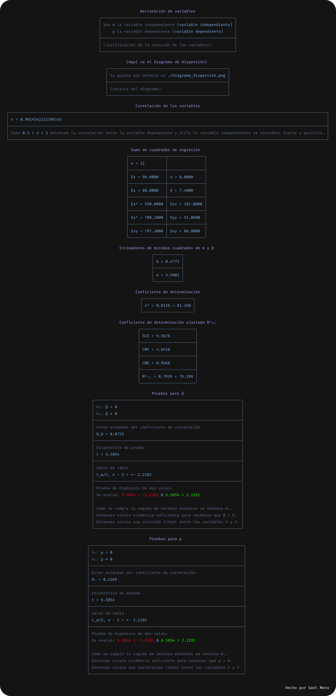

# Proyecto de Regresión y Visualización de Datos

## Tabla de Contenidos

1. [Descripción](#descripción)
2. [Funcionalidades](#funcionalidades)
3. [Requisitos](#requisitos)
   - [Dependencias](#dependencias)
4. [Instalación y Configuración del Entorno Virtual](#instalación-y-configuración-del-entorno-virtual)
5. [Uso](#uso)
6. [Screenshots](#screenshots)
7. [Notas Adicionales](#notas-adicionales)
8. [Contribuciones](#contribuciones)

## Descripción

Este proyecto permite realizar un análisis de regresión entre dos conjuntos de datos y visualizarlos tanto mediante gráficos generados con **Matplotlib** como con salidas en formato **ASCII**. La herramienta calcula la correlación entre los datos, genera gráficos de dispersión y presenta los resultados en una tabla formateada en la terminal.

## Funcionalidades

- **Cálculo de Regresión y Correlación:**
  Implementa el método de Pearson para determinar la correlación entre la variable independiente y la dependiente.

- **Visualización de Datos:**
  - **Gráficos con Matplotlib:** Se generan diagramas de dispersión con un estilo oscuro para una mejor visualización.
  - **Salida en ASCII:** Opción de visualizar el gráfico en la terminal usando `plotext` para quienes prefieren una salida en texto.

- **Hipótesis:**
  Realiza pruebas de hipótesis para verificar si hay correlación y/o regresión lineal.

- **Presentación de Resultados:**
  Los resultados, incluyendo el coeficiente de correlación, se muestran en una tabla formateada en la terminal utilizando la librería `rich`.

## Requisitos

- Python 3.6 o superior.

### Dependencias

El proyecto utiliza las siguientes librerías:
- matplotlib
- numpy
- scipy
- rich
- plotext (opcional, para salida en ASCII)

## Instalación y Configuración del Entorno Virtual

1. **Clonar el repositorio:**

   ```bash
   git clone https://github.com/m0r4a/linear_regression.git
   cd linear_regression
   ```

2. **Crear y activar el entorno virtual:**

   - En Unix/macOS:
     ```bash
     python3 -m venv venv
     source venv/bin/activate

     ```
   - En Windows:
     ```bash
     python -m venv venv
     venv\Scripts\activate
     ```

3. **Instalar las dependencias:**

   ```bash
   pip install -r requirements.txt
   ```

## Uso

El archivo principal `main.py` contiene un ejemplo de cómo se configuran los datos y se ejecuta el análisis. En este ejemplo, se definen dos arreglos de datos para las variables independiente y dependiente, y se invoca la función de regresión que realiza las siguientes acciones:

- Calcula la correlación entre los datos utilizando el método de Pearson.
- Muestra el coeficiente de correlación y su conclusión en una tabla formateada en la terminal mediante `rich`.
- Genera un diagrama de dispersión de los datos utilizando Matplotlib, guardando la imagen por defecto en `./diagrama_dispersion.png`.

Para ejecutar el análisis, simplemente ejecuta:

```bash
python main.py
```

## Screenshots

### Gráfico de dispersión: ASCII

<p align="center">
    
</p>

### Gráfico de dispersión: Imagen

<p align="center">
    
</p>

### Tablas

<p align="center">
    
</p>

## Notas Adicionales

- **Salida ASCII:** Si deseas ver el gráfico en formato ASCII, asegúrate de tener instalada la librería `plotext` (incluida en el `requirements.txt`).
- **Modularidad:** El código está estructurado de forma modular, lo que facilita la extensión o modificación de funcionalidades.

## Contribuciones

Este código está pensado para ser de un solo uso. Se aceptan contribuciones en forma de correcciones o mejoras en el código, pero se prefiere no añadir nuevas funcionalidades mediante PRs.
